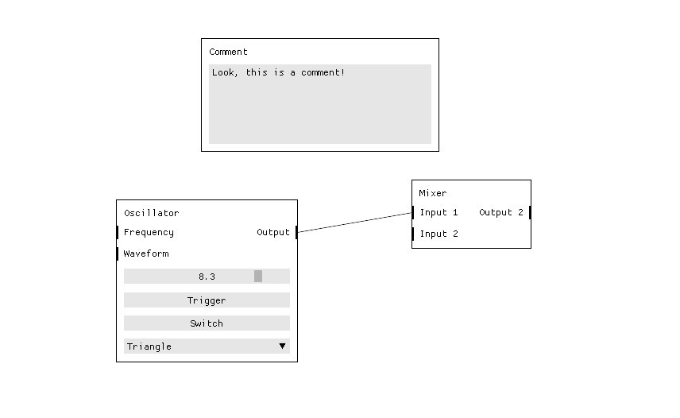

# Gazpatcho

A Rust library providing a graphical node-based graph editor.



TODO: What it can be used for

Heapnotize can be used to store values somewhere in memory while keeping a
reference to them. Like [`Box`](https://doc.rust-lang.org/std/boxed/index.html),
it can be used for nested types for which indirection is required. Unlike `Box`,
this library is implemented with `#[no_std]` and thus it can help with memory
management on microcontrollers.

TODO: 3 things, config, run, report

The two main data types of Heapnotize are `Rack` and `Unit`. `Rack` is used to
allocate predefined chunk of the stack for a predefined type. `Unit` provides an
ownership for values stored there. `Unit` also ensures that once it goes out of
scope, the value it refers to will be properly dropped.

Documentation:

* [API reference (docs.rs)](https://docs.rs/gazpatcho)
* [Repository (github.com)](https://github.com/zlosynth/gazpatcho)
* [Crate (crates.io)](https://crates.io/crates/gazpatcho)

## Usage

Add the following to your `Cargo.toml`:

``` toml
[dependencies]
gazpatcho = "0.1"
```

In order to store values on the stack, we first need to initialize the `Rack`
with a specific capacity. Available capacities are currently powers of 2 from 1
up to 1024. The whole size will be allocated when a `Rack` is created. After
that, it is possible to store values on the rack and get a handle on them as
`Unit` object. It is the possible to derefence the `Unit` to get access to the
value. Once the `Unit` gets out of scope, the value would be freed from the
rack:

``` rust
fn main() {
    let rack = Rack64::new();
    let unit = rack.must_add(10);
    assert_eq!(*unit, 10);
}
```

Where Heapnotize may become really handy is when dealing with recursive types,
where a type contains a value of the same time. Rust cannot know how much memory
a recursive type requires on compile time, therefore, indirection must be used.
This is nicely covered in [The
Book](https://doc.rust-lang.org/book/ch15-01-box.html#enabling-recursive-types-with-boxes)
where `Box` is used to enable this, that however requires use of the heap.
The following example shows how to handle recursive types on the stack using
`Rack` and `Unit`:

``` rust
enum List<'a> {
    Cons(i32, Unit<'a, List<'a>>),
    Nil,
}

use List::{Cons, Nil};

fn main() {
    let rack = Rack64::new();
    let list = Cons(1, rack.must_add(Cons(2, rack.must_add(Cons(3, rack.must_add(Nil))))));
}
```

See the [documentation](https://docs.rs/heapnotize) to learn more.

# License

Gazpatcho is distributed under the terms of the General Public License
version 3. See [LICENSE](LICENSE) for details.

# Changelog

Read the [CHANGELOG.md](CHANGELOG.md) to learn about changes introduced in each
release.
